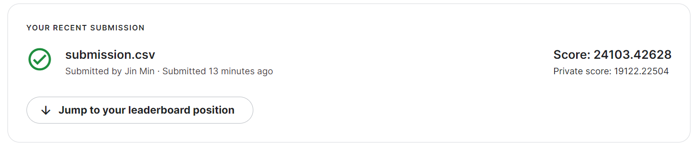

#  Project 2: Ames Housing Data and Kaggle Challenge

### Problem statement

Ames Planning & Housing Department (APHD) seeks to build a predictive model that can predict the housing prices base on users' inputs. The model will be made public on the APHD website such that residents in Ames are able to (i) better understand and plan their finances before heading down to take a look at the house (saves a wasted trip) and (ii) know the current market rate to prevent potential buyers from being ripped off.

### Dataset description

The dataset description can be found [here](./DataDocumentation.txt) 

There are three files in this project:

[train.csv](./datasets/train.csv)-- this data contains all of the training data for our model.
The target variable (SalePrice) is removed from the test set!

[test.csv](./datasets/test.csv) -- this data contains the test data for our model. We will feed this data into our regression model to make predictions.

[sample_sub_reg.csv](./datasets/sample_sub_reg.csv) -- An example of a correctly formatted submission for this challenge (with a random number provided as predictions for SalePrice. 

### The Modelling Process

1. The train dataset has all of the columns that needed to generate and refine our models. The test dataset has all of those columns except for the SalePrice that we are trying to predict in our Regression model.

2. Generate the regression model using the training data. Within this process, we'll be making use of:
    - train-test split
    - cross-validation / grid searching for hyperparameters
    - strong exploratory data analysis to question correlation and relationship across predictive variables
    - code that reproducibly and consistently applies feature transformation (such as the preprocessing library)
    
3. Predict the values for the SalePrice in the test dataset and submitting the predictions to Kaggle to see how our model does against unknown data.

4. Evaluate our models
    - consider the evaluation metrics
    - consider the baseline score
    - how can the model be used for inference?
    

    
### Conclusions/Recommendations

**Conclusion:** 

The top 3 factors affecting the price of a house in Ames are: 
- Gr Liv Area: Above grade (ground) living area square feet
- Overall Qual: Rates the overall material and finish of the house
- Year Built: Original construction date

For instance, an increase in 1 sqft of Gr Liv Area will result in a ~$0.14 increase in the price of houses in Ames.

**Recommendations:**

- Potential home buyers looking for flats may reconsider looking at a house with smaller Gr Liv Area, lower Overall Qual and older Year Built if the houses are above their budget.

### Kaggle challenge submission 

